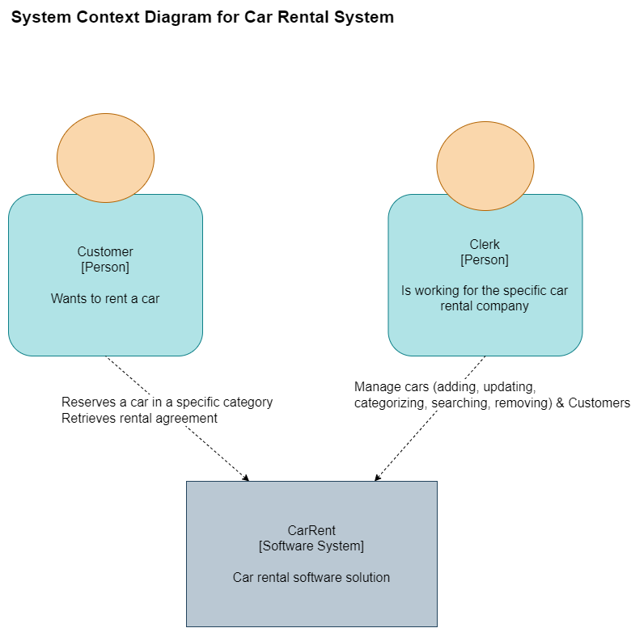
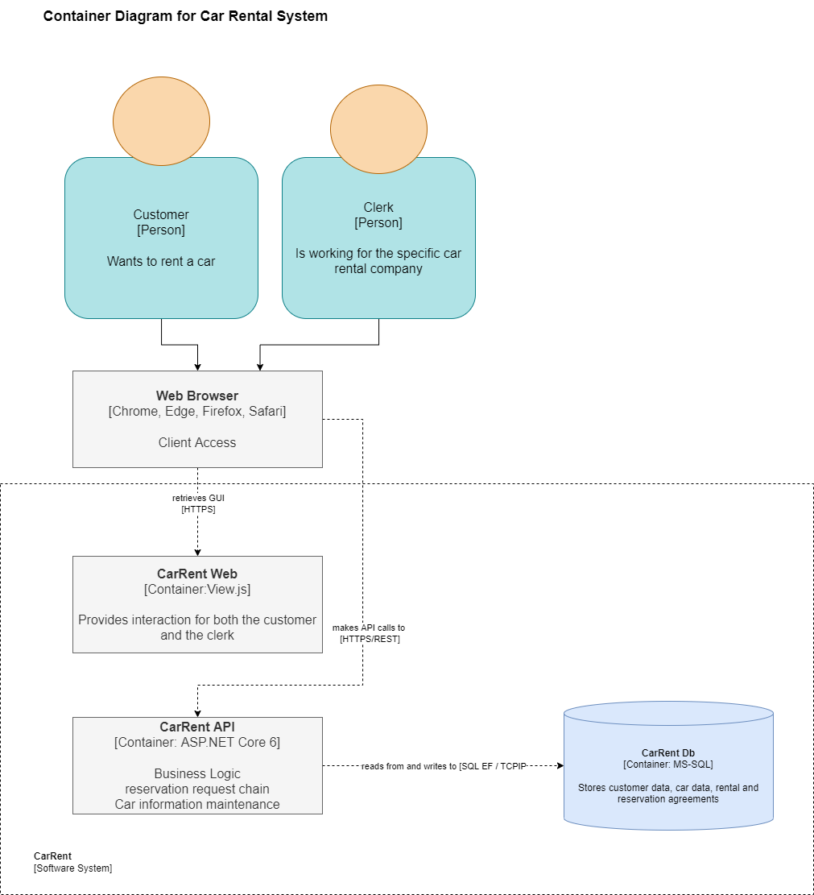
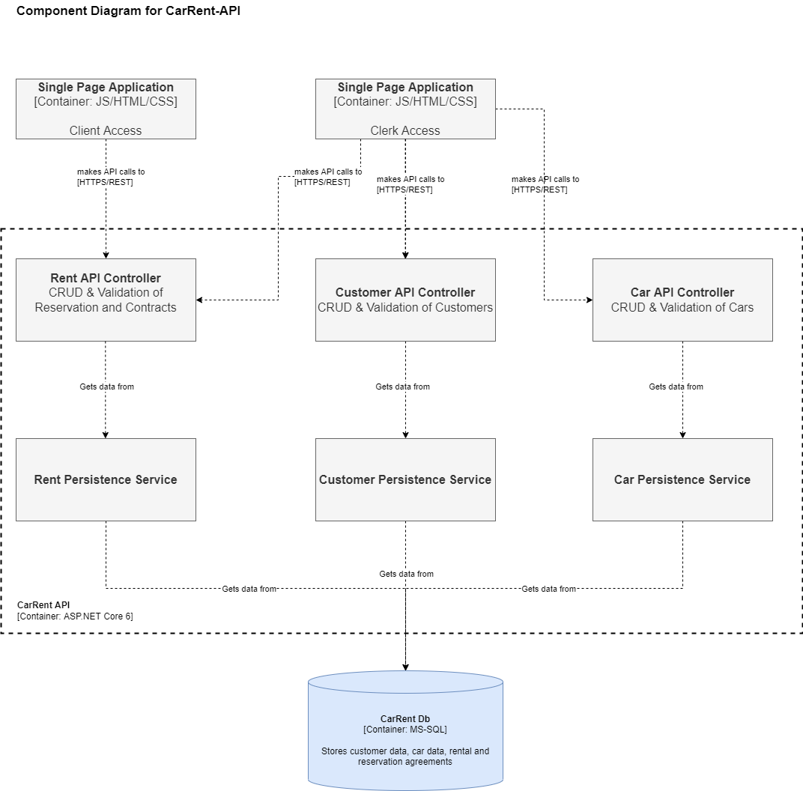
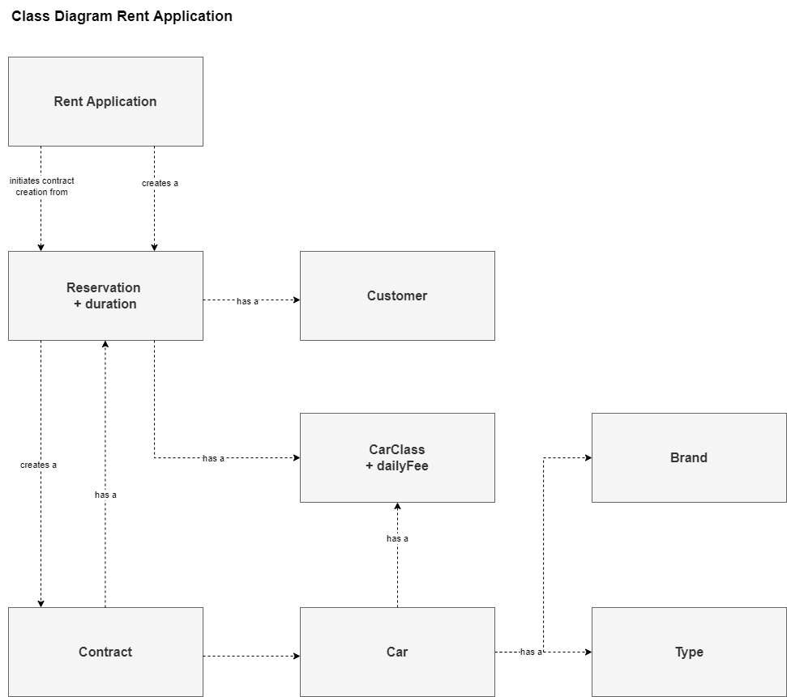
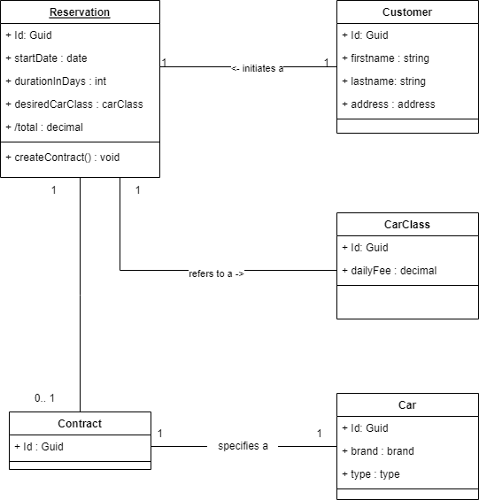
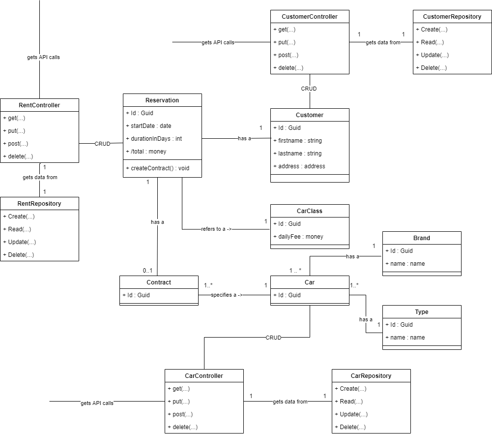
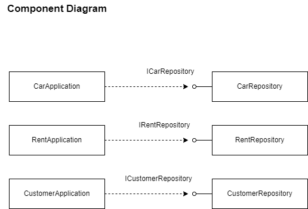
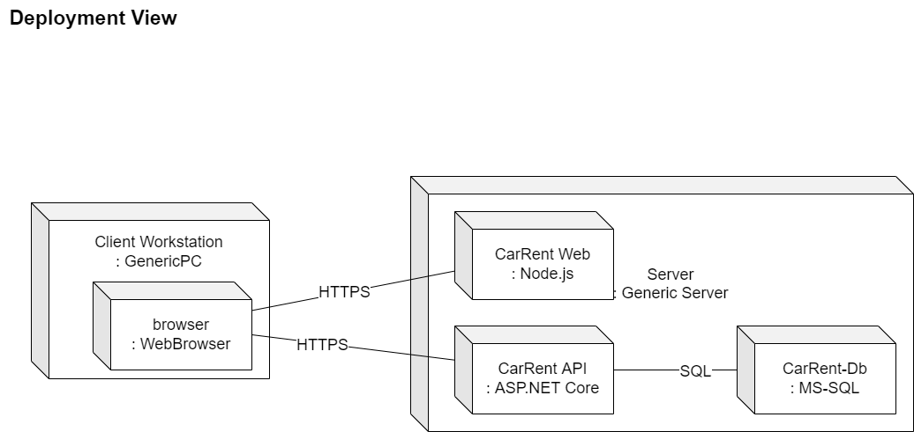

# CarRent 

## Dokumentation (Aufgaben und Ziele)

### Aufgabenstellung
Es soll ein neues Autovermietungssystem „CarRent“ erstellt werden. Das System soll aus einem Server-Teil und
optional einen Web-Client bestehen.
- Die Daten sollen mittels Repository Pattern in eine Datenbank gespeichert werden können.
- Die Business Logik soll auf dem Backend laufen und eine REST APIs anbieten.
- Es soll zuerst ein Monolith erstellt werden und später auf eine Micro Service Architektur überführt
werden.
Optional:
- Der Web-Client benutzt die REST API um die Funktionen auszuführen.
Folgende Detailinformationen liegen unstrukturiert über das zu entwickelnde System vor:
- Der Sachbearbeiter kann Kunden mit Namen und Adresse und Kundennummer im System verwalten,
d.h. erfassen, bearbeiten, löschen und den Kunden mit dessen Namen oder Kundennummer suchen.
- Der Sachbearbeiter kann zudem die Autos von CarRent verwalten und nach denen suchen.
- Jedes Auto kann einer bestimmten Klasse zwischen Luxusklasse, Mittelklasse oder Einfachklasse
zugeordnet werden und besitzt zudem eine Marke, einen Typ und eine eindeutige Identifikation.
- Jede Klasse besitzt eine Tagesgebühr.
- Bei einer neuen Reservation kann der Kunde ein Auto aus einer bestimmten Klasse wählen. Er muss
zudem die Anzahl der Tage angeben, die er das Auto gerne mieten möchte. Dabei werden die
Gesamtkosten berechnet. Wird die Reservation gespeichert, so wird sie mit einer Reservationsnummer
ablegt.
- Bei Abholung des Autos wird die Reservation in einen Mietvertrag umgewandelt.

#### Use Case 1: CRUD & Search Customers
Der Sachbearbeiter kann Kunden im System verwalten (CRUD).

#### Use Case 2: Search Customers
Der Sachbearbeiter ist in der Lage die Kunden im System zu suchen und zu finden.

#### Use Case 3: CRUD Cars
Der Sachbearbeiter verwaltet Fahrzeuge im System (CRUD). Der Sachbearbeiter kann Fahrzeuge einer bestimmten Klasse (Luxusklasse, Mittelklasse, Einfachklasse), Marke, Typ und eindeutiger ID zuweisen.

#### Use Case 4: Search Cars
Der Sachbearbeiter sucht und findet Fahrzeuge im System mittels derer ID.

#### Use Case 5: Daily Fee
Der Sachbearbeiter kann der Fahrzeugklasse eine Tagesgebühr zuweisen.

#### Use Case 6: Reservation
Der Kunde kann eine Reservation auf eine bestimmte Fahrzeugklasse mit einer bestimmten Anzahl Tage erstellen. Die Gesamtkosten werden vom System automatisch berechnet. Beim Speichern der Reservation wird durch das System eine Reservationsnummer vergeben.

#### Use Case 7: Contract creation
Das System erstellt einen Mietvertrag basierend auf der Reservation, sobald der Kunde das Fahrzeug abholt.

### Qualitätsziele
#### Priorität
- System Verfügbarkeit: Auch bei einem Ausfall vom System, soll die Applikation innerhalb 3 Minuten verfügbar sein.
- Daten Konsistenz: Bei einem Ausfall darf kein Datenverlust passieren.

### Stakeholder
| Rolle | Kontakt | Erwartungshaltung |
|----------|:---------:|:---------:|
| Lehrperson | Cédric Menzi | Dokumentation nach arc42 |

## Randbedingungen
- Die Daten sollen mittels Repository Pattern in eine Datenbank gespeichert werden können.
- Die Business Logik soll auf dem Backend laufen und eine REST APIs anbieten.
- Es soll zuerst ein Monolith erstellt werden und später auf eine Micro Service Architektur überführt werden

## Kontextabgrenzung
- Login und Authentifizierung von Kunden und Sachbearbeitern wird in diesem Projekt ausgeblendet

## Lösungsstrategie
- Implementierung des Repository Patterns
- Trennung des Persistence und Business Layers über Interfaces
- Zugriff über REST APIs
- Design als Monolith, aber schon vorbereitet, um in eine Micro Service Architektur überführt zu werden
- Domain Driven Design

## Modelle
### Context

### Containers

### Components

### Classes

## Domain Model

## Whitebox Gesamtsystem
### Class Diagram

### Component Diagram - Interfaces

## Verteilungssicht
### Deployement View

